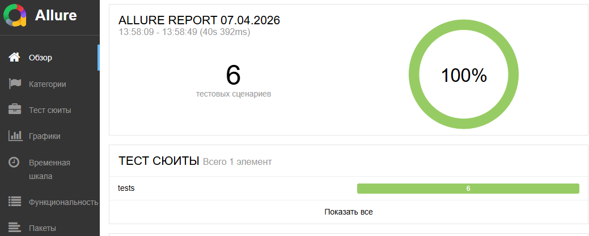
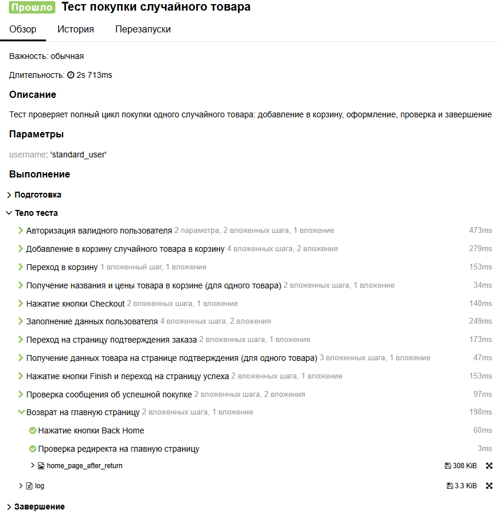

# Тестовый фреймворк на основе pytest и Selenium для автоматизации интернет-магазина Saucedemo

Автоматизированное тестирование действующего интернет-магазина Saucedemo с использованием языка Python, Selenium WebDriver, pytest и allure для генерации отчетов

## 🚀 Особенности

- **Page Object Model (POM)** — чистая и поддерживаемая структура тестов
- **Логирование** — подробные логи каждого шага для упрощения отладки
- **Генерация данных** — библиотека Faker для создания реалистичных тестовых пользователей
- **Генерация подробных отчетов** - подробные отчеты со скринами реализованные через Allure

## 🛠️ Стек технологий

- **Python** 3.8+
- **Selenium WebDriver** — управление браузером
- **pytest** — фреймворк для тестирования
- **Faker** — генерация тестовых данных
- **Allure** — генерация отчетов о прохождении

## 🧪 Запуск тестов

### Установка и подготовка

1. Клонируйте репозиторий:
   ```bash
   git clone https://github.com/ВАШ_ЛОГИН/saucedemo.git
   cd saucedemo

2. Создайте и активируйте виртуальное окружение:
   ```bash
   python -m venv .venv
   source .venv/bin/activate  # для Linux/Mac
   .venv\Scripts\activate     # для Windows

3. Установите зависимости:
   ```bash
   pip install -r requirements.txt
   
4. Настройка alias для Allure (Windows PowerShell):
   ```bash
   Set-Alias allure U:\ddfomin_project\allure-2.30.0\bin\allure.bat

5. Запуск всех тестов:
   ```bash
   pytest -vs --alluredir=tests\allure-results .\tests --clean-alluredir

6. Запуск конкретного теста:
   ```bash
   pytest -vs --alluredir=tests\allure-results .\tests\test_delete_product_from_cart.py
   
7. Открытие отчета:
   ```bash
   allure serve .\tests\allure-results

### Пример отчета Allure

